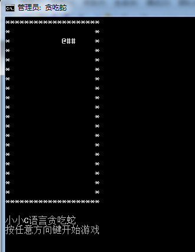

# 运行环境

win7 + vs2010

# 设计思路与数据结构
```
char GameMap[H][W];   //游戏地图  

typedef struct head{
	int x;
	int y;
	int dir;
	head(int _x = -1, int _y = -1, int _dir = -1)
	{
		x = _x;
		y = _y;
		dir = _dir;
	}
}Head; 

typedef struct body{
	int x;
	int y;
	body(int _x = -1, int _y = -1)
	{
		x = _x;
		y = _y;
	}
}Body; 

typedef struct snake
{
	Head sh;
	vector<Body> sb;
	int sbLen;
}Snake;
```

## 画图数据设计

## 蛇数据设计

## 运行逻辑

```
sleep
clear
repaint
```

# 程序运行版本与运行截图

## 1 实现打印小蛇


## 2 实现能跑动的小蛇

根据方向让蛇数据变化，在重画显示的时候可以看到移动效果

```
void Move()
{
	int newHeadx = mySnake.sh.x + dx[mySnake.sh.dir];
	int newHeady = mySnake.sh.y + dy[mySnake.sh.dir];

	for(int i=0;i<mySnake.sbLen;i++)
	{
		mySnake.sb[i].x = mySnake.sb[i].x + dx[mySnake.sh.dir];
		mySnake.sb[i].y = mySnake.sb[i].y + dy[mySnake.sh.dir];
	}

	mySnake.sh.x = newHeadx;
	mySnake.sh.y = newHeady;

	setGraph();
}
```

## 3 能控制方向（键盘事件添加）

### 处理蛇移动 改变数据
```
void Move()
{
	int newHeadx = mySnake.sh.x + dx[mySnake.sh.dir];
	int newHeady = mySnake.sh.y + dy[mySnake.sh.dir];

	/*  //error codes
    for(int i=0;i<mySnake.sbLen;i++)
	{
		mySnake.sb[i].x = mySnake.sb[i].x + dx[mySnake.sh.dir];
		mySnake.sb[i].y = mySnake.sb[i].y + dy[mySnake.sh.dir];
	}
    */
    //
	for(int i=1;i<mySnake.sbLen;i++){
		mySnake.sb[i].x=mySnake.sb[i-1].x;
		mySnake.sb[i].y=mySnake.sb[i-1].y;
	}
	mySnake.sb[0].x = mySnake.sh.x;
	mySnake.sb[0].y = mySnake.sh.y;

	mySnake.sh.x = newHeadx;
	mySnake.sh.y = newHeady;

	setGraph();
}
```

### 键盘事件添加

```
int key; // 全局变量

void Button()
{
	if(kbhit() != 0) //检查当前是否有键盘输入，若有则返回一个非0值，否则返回0  
	{   
		while(kbhit() != 0)  //可能存在多个按键,要全部取完,以最后一个为主  
		key = getch(); //将按键从控制台中取出并保存到key中  
		switch(key)  
		{   //左  
			case 75: 
					mySnake.sh.dir = 0;
				break;  
				//右  
				case 77:  
					mySnake.sh.dir = 1;
				break;  
				//上  
			case 72:  
					mySnake.sh.dir = 2;
				break;  
				//下  
			case 80:  
					mySnake.sh.dir = 3;
				break;  
		}  
	}  
}
```

## 4 随机产生食物


## 5


# 不足与改进


# 作者与参考